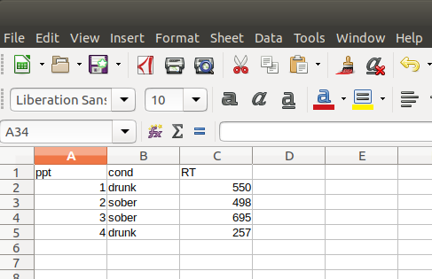
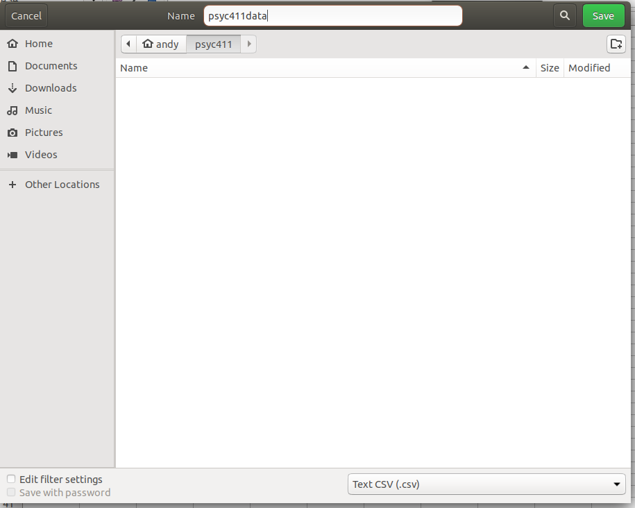

# Entering data by hand
_Andy Wills_

## Before you start...
This guide assumes you have completed the [Introduction to RStudio](intro-rstudio.html) and [Exploring Data](exploring-incomes.html) worksheets, and that you've completed the [Using projects in RStudio](using-projects.html) worksheet up until the point where you were asked to look at this worksheet. If this is not the case, do those earlier worksheets first.  

## Contents

- [Introduction](#intro)
- [Entering data into a spreadsheet](#enter)
- [Saving data from a spreadsheet](#save)
- [Uploading data to RStudio server](#upload)
- [Repeated measures, long format](#repeat)

## Introduction
Many areas of psychology now use computers to collect as well as analyse their data, so entering data by hand is increasingly rare. It's also not a particularly good idea, as entering data by hand is very prone to error. However, sometimes there is no alternative -- for example, when the data was collected by hand. This guide explains how to enter data by hand. 

The example I use in this guide is a simple experiment in which we have one piece of recorded data for each participant - their mean reaction time in an "emergency stop" procedure in a driving simulator. Some people go into the simulator sober, others have had one unit of alcohol. We want to examine whether low doses of alcohol increase reaction time (they do). 

So, for each participant, we need to record three things: their reaction time, which group they are in (drunk or sober) and their unique participant number (not their name, psychological data is stored anonymously wherever possible).

We don't use RStudio to enter data by hand. Instead, we use a spreadsheet application to enter data, and load the spreadsheet into RStudio. 

## Entering data into a spreadsheet

1. **Open your spreadsheet application** - I'm using [Libre Office](https://www.libreoffice.org/) because it's free, open source, and really great. If you prefer, you can use Excel. Once you leave university, Excel will cost you about [£80 a year](https://products.office.com/en-gb/compare-all-microsoft-office-products?tab=1)

2. **Enter the column names** - We use the first row on the spreadsheet to enter the column names. Here, I've chosen `ppt` for participant number, `cond` for condition (`drunk` or `sober`), and `RT` for their mean reaction time. You can choose whatever names suit your data. Don't use spaces. Do start names with a letter (e.g. `threeD`, and `D3` are fine. `3D` and `Three D` should be avoided).

3. **Enter the data** - Each participant gets their own row on the spreadsheet. So, if participant 1 was drunk and had a mean reaction time of 550 milliseconds, the second line would look as shown above.

## Saving data from a spreadsheet

1. Click on "File -> Save As..."

2. **Choose CSV**: The box at the bottom right (see below) says "Text CSV". This indicates the type of file you are saving. Your spreadsheet application will not automatically save as a CSV file, so you'll need to click on this box to change it to "Text CSV". 
**If you're using Excel**, this step is slightly different, see this [short video](https://www.youtube.com/watch?v=jxOi0okA7Fg).

 

3. **Choose your Downloads folder**.
  
4. **Name your data file**: Give the file you are saving a sensible name. Here, I've called it "psyc411data". It would be better to use a name that was unique to your group, and to the date you finished collecting the data. So, something like "psyc411_wills_2018_10_15" would be good. 
 
5. **Save it!** Once you've done all this, click on the "Save" button.

## Uploading files to RStudio server

6. Log in to <a href = "https://rstudio.plymouth.ac.uk" target = "blank">RStudio server</a>, if you have not already done so.

7. Click on the 'Files' tab in RStudio server.

8. Click the 'Upload' button.

9. Click 'Browse...'

10. Go to your Downloads folder, and select the csv file you just saved there.

11. Click "OK".

**`unexpected response from server` error**:  In rare cases, you might experience this error message. If so, changing to a different browser (e.g. Explorer or Edge) sometimes resolves this issue. The issue may be caused by certain specialist software running on _your_ machine, for example software installed to support dyslexia. If you are running such software and encounter this error, report the issue to the person or company that installed your support software.

## Repeated measures, long format

Sometimes, you will have taken more than one measurement of the same _dependent variable_ from each participant. For example, you might have measured their reaction time _before_ and _after_ they drunk a unit of alcohol. In R, each repeated measurement gets its own row. For example:

| ppt  | cond | RT  |
| ---- | ---- | --- |
| 1    | before | 545 |
| 1    | after  | 750 |
| 2    | before | 341 |
| 2    | after  | 978 |

This is sometimes referred to as _long_ format. 

___

This material is distributed under a [Creative Commons](https://creativecommons.org/) licence. CC-BY-SA 4.0. 

