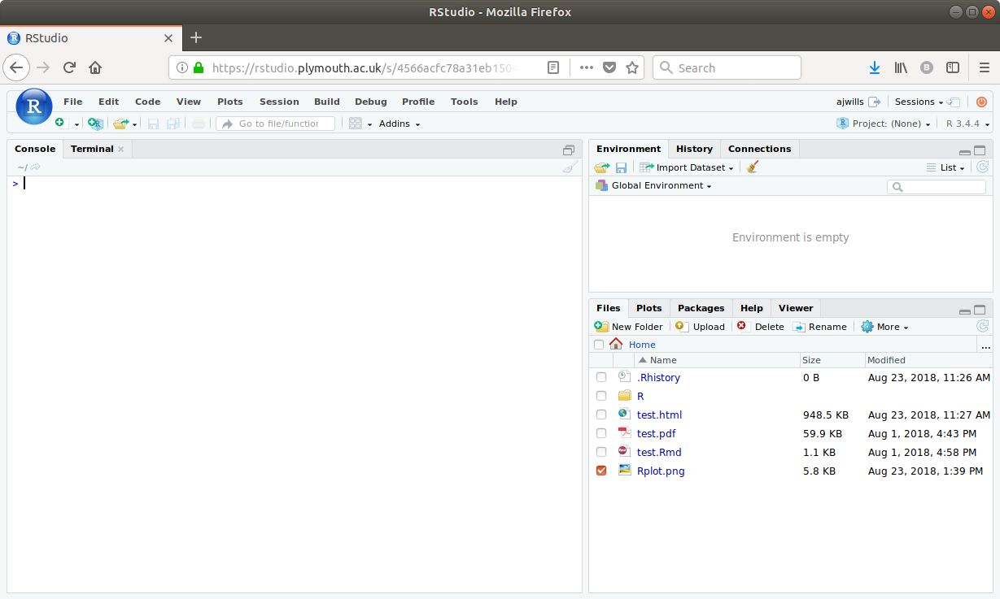

# Introduction to RStudio
_Andy Wills, Paul Sharpe, Stuart Spicer, Ben Whalley_

## Starting RStudio

Using your web browser, go to an <a href = "https://rstudio.plymouth.ac.uk" target = "blank">RStudio server</a> and log on, using the username and password you have been given. 

_NOTE_: We strongly recommend using the [Firefox](https://www.mozilla.org/en-US/firefox/new/) web browser to access RStudio. If you are having problems and you're using something other than Firefox, the first thing to try is to download and install Firefox on your machine and see if it fixes the problem. Firefox is free and open source.

## First look at RStudio

You'll be greeted with a screen that looks something like this:

When you open RStudio for the first time, you can see three parts: 

1. The **Console** - This is the large rectangle on the left. This is where R prints the answers to your questions. 

2. The **Environment** - This is the rectangle on the top right. This is where R keeps a list of the data it knows about. It's empty at the moment, because we haven't given R any data yet.

3. The **Files** - This is the rectangle on the bottom right. This is a bit like the _File Explorer_ in Windows, or the _Finder_ on a Mac. It shows you what files and folders R can see.

You should also be able to see that the two rectangles on the right have a number of other "tabs". These work like tabs on a web browser.  

The top rectangle has the tabs "Environment" and "History". The **History** tab keeps a record of commands you've given R. This can sometimes be useful.

The bottom rectangle has the tabs "Files", "Plots", "Packages", "Help", and "Viewer". We'll cover what these other tabs do later on. 

## Creating a project

RStudio uses _projects_ to help you keep your work organized, and to make sure you have a reproducible record of your analyses. Reproducible analysis is essential to good, open science. 

An R Studio project is a way to organise data and anlyses that belong together. We're going to use **one** project to organize all the analyses and data you'll do and use during this first part of the _Absolute Beginners' Guide to R_. **Don't** create a new project for each worksheet, keep the same project until we get to the end of this guide (Plymouth University students: **one** project for **all** of PSYC411, please).

Here's how to create a new project:

1. At the top right of RStudio, you will see a little blue cube, with the text "Project: (none)". Click on this. 

2. Now click "New Directory"

3. Now click "New Project"

4. Next, type in a name for the project that makes sense to you in the "Directory name" box. I've typed _psyc411_, a module code (**Plymouth University students, please do the same**). Then click "Create project". **NB**: You must not use most punctuation, including spaces, in project names (`_` and `-` are OK). For example, both `Fish & Chips` and `Fish&Chips` will cause non-obvious errors later on. Use one of these instead: `FishChips`, `fishchips`, Fish_and_Chips`, `Fish-Chips`.

5. Now, create a _R script_. An R script is a place to keep your analysis commands safely stored. You create an R Script by clicking on the white plus sign on a green background (see below), and then clicking on "R Script".

If everything worked well, your screen should now look something like this:

Notice that, now you've opened a project, RStudio looks slightly different. The two main changes are:

* There is now a new type of tab on the top left. This is a _Script_ tab, which we're going to use in a moment. 

* The _Files_ tab (bottom right) is nearly empty. This tab will now only show the files in your project. This makes it easier to keep stuff organized.

## Your first R script

We're now going to write a very simple R script. In the script file you have just made, enter the following:

`# My first R script`

In R, any line beginning with a `#` is a **comment**. This means it's text design to be read only by humans, the `#` tells the computer to ignore anything else written on that line. It is helpful to include comments in your scripts -- as you go through this guide, write comments so as to remind yourself what you did and why. 

You should notice that the name `Untitled1` on the script tab has now gone red. This is to remind you that your script has changed since the last time you saved it. So, click on the "Save" icon (the little floppy disk) and save your R script **using the name `exploring.R`**. The `.R` indicates that it is an R script.

**Please now move on to the next worksheet**.

___

This material is distributed under a [Creative Commons](https://creativecommons.org/) licence. CC-BY-SA 4.0. 

