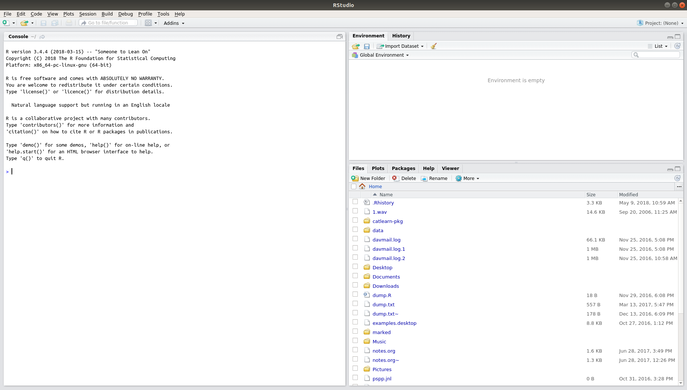
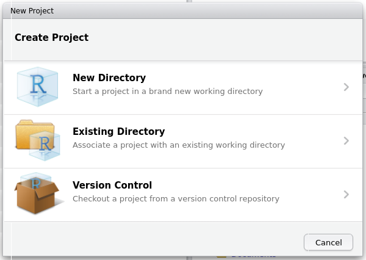
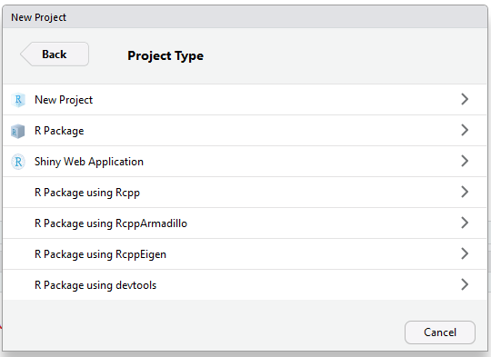
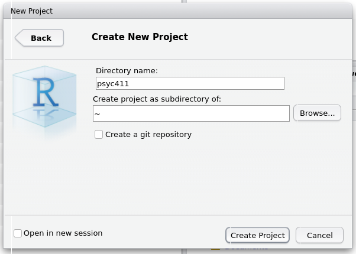
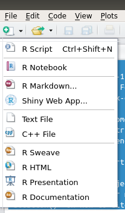
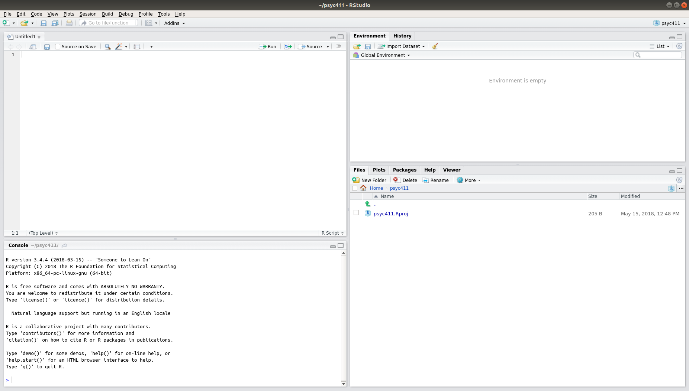

# Using RStudio projects
_Andy Wills_

## Before you start...

Before starting this exercise, you should have had a brief introduction to getting and using RStudio -- [Introduction to RStudio](intro-rstudio.html). You should also have also completed the workshop exercises for [Exploring Data](exploring-incomes.html), [Group Differences](group-differences.html), and [Evidence](evidence.html). If not, take a look these earlier worksheets before continuing.

Log in to <a href = "https://rstudio.plymouth.ac.uk" target = "blank">RStudio server</a>.

## Contents

- [Creating a new project](#create)
- [Writing an R script](#write)
- [Running an R script](#run)
- [Exercise: Analysis using an R script](#ex1)
- [Downloading files from RStudio Online](#download)

<a name="create"></a>

## Creating a new project

RStudio uses _projects_ to help you keep your work organized, and to make sure you have a reproducible record of your analyses. Reproducible analysis is essential to good, open science. 

We're going to use a project to organize the analyses of data you have collected. You should start a new project for each different study you conduct throughout your degree.

Here's how to create a new project:


1. At the top right of RStudio, you will see a little blue cube, with the text "Project: (none)". Click on this. 


2. Now click "New Directory"



3. Now click "New Project"



4. Next, type in a name for the project that makes sense to you in the "Directory name" box. I've typed _psyc411_, a module code. Then click "Create project".



5. Now, create a _R script_. An R script is a place to keep your analysis commands safely stored. You create an R Script by clicking on the white plus sign on a green background (see below), and then clicking on "R Script".



If everything worked well, your screen should now look like this:



Notice that projects in RStudio look slighlty different to how you've been using RStudio up until now. The two main changes are:

* There is now a new type of tab on the top left. This is a _Script_ tab, which we're going to use in a moment. 

* The _Files_ tab (bottom right) is nearly empty. This tab will now only show the files in your project. This makes it easier to keep stuff organized.

<a name="write"></a>

## Writing an R script

We're now going to write an R script to organize the analysis of the data you collected during this module.

### Load packages

You should be familiar with this command by now: `library(tidyverse)`. The slight difference this time is that you're going to type (or paste) it as the first line of your R script (top left window), **not** into the _Console_.

You should notice that the name `Untitled1` on the tab has now gone red. This is to remind you that your script has changed since the last time you saved it. So, click on the "Save" icon (the little floppy disk) and save your R script with some kind of meaningful name. I've called mine `psyc411analysis.R`. The `.R` indicates that it is an R script.

### Loading data
Next, you're going to need to load your own data. The [Entering Data by Hand](entering-data-by-hand.html) worksheet explains how to do this, so take a look at that now. Once you've read it and done it, add this command to the next line of your script:

`p411data <- read_csv("psyc411data.csv")`

If you gave your CSV file a different name, change the name inside the quote marks accordingly.

Save your script again (click the Save icon), so you don't lose anything. Do this each time you add something important to your script. 

<a name="run"></a>

## Running an R script

Put your cursor on line 1 of your script and press CTRL+ENTER (i.e. press the key marked 'Ctrl' and the RETURN or ENTER key together). Line 1 is automatically copied to your _Console_ window and run. The cursor moves to line 2. Press CTRL+ENTER again to run the second line.

<a name="ex1"></a>

## Exercise: Analysis using an R script

You've written and run a working R script --- it doesn't do much yet! In order to analyse the data from your experiment, you need to use the commands you've learned up until now. The things you'll need to do are:

1. Produce an appopriately labelled density plot of your dependent variable, with one line for each of your between-subject groups.

2. Calculate your effect size.

3. Perform a between-subjects t-test.

4. Perform a Bayesian t-test.

**Write a script to do these analyses on your data.**

### Example script
Here's what such a script looks like for the gender pay gap analyses. The lines that begin `##` are comments. They are ignored by R but they help human readers work out what is going on.

```
## Load packages 
library(tidyverse)
library(effsize)
library(BayesFactor)

## Load data
cpsdata <- read_csv("cps2.csv")

## Produce density plot
cpsdata %>% ggplot(aes(income, colour=factor(sex))) + geom_density(aes(y=..scaled..)) +
  xlab("Income in US Dollars") + ylab("Density")

## Calculate effect size
cohen.d(cpsdata$income ~ cpsdata$sex)

## Perform t-test
t.test(cpsdata$income ~ cpsdata$sex)

## Perform Bayesian t-test
ttestBF(formula = income ~ sex, data = data.frame(cpsdata))
```

<a name="download"></a>

### Downloading files from RStudio Online

In order to use files from RStudio Online in other applications (e.g. Microsoft Office, LibreOffice), you'll need to download them. Here's how:

1. Click on the 'Files' tab in RStudio Online, and click the tick box to select your file (it will have whatever filename you just gave it.). 

2. Click on "More" (next to the little blue gear wheel), and then "Export...". 

3. Click "Download". The file will now be in the Downloads folder of your computer. 

___

This material is distributed under a [Creative Commons](https://creativecommons.org/) licence. CC-BY-SA 4.0. 


