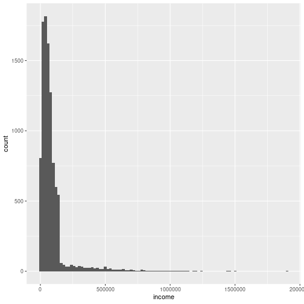

Means and medians
========================================================
author: Andy Wills  
date: 
autosize: true


Median
======


```r
data
```

```
[1]  1  2  2  3  3  3  4  4 50
```

- The median is the middle number when the data is put in order


```r
median(data)
```

```
[1] 3
```

Mean
====


```r
data
```

```
[1]  1  2  2  3  3  3  4  4 50
```

- The mean is the sum of all the numbers (72), divided by the sample size (9), giving:


```r
mean(data)
```

```
[1] 8
```

Comparison
=====


```r
data
```

```
[1]  1  2  2  3  3  3  4  4 50
```

- In this case, the mean (8) is bigger than nearly all the numbers. This means it's not very _representative_ of its sample.

- The mean will always be unrepresentative when there are a few numbers that are very high (or very low), compared to the rest.

- In these cases, we say the distibution is _skewed_.

Skewness
====



- Our _income_ data is skewed, so the median gives a better indication of average salary than the mean in this case.

